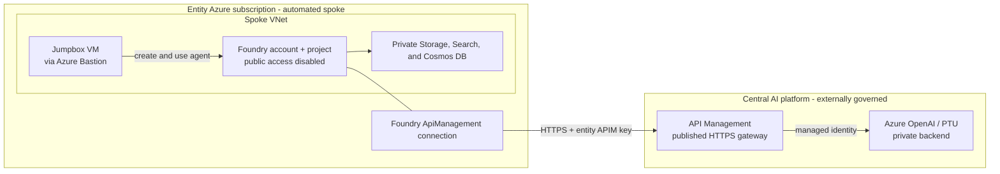
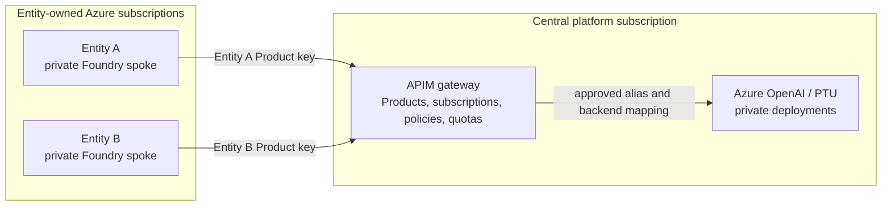

# Microsoft Foundry Agent behind a Central API Management Gateway

Deploy a **private-network Microsoft Foundry standard agent** (spoke) that consumes an LLM
served through an **existing Azure API Management (APIM) gateway**. By default, Foundry calls
APIM's published public HTTPS endpoint; the APIM instance, Azure OpenAI resources, PTU
deployments, and backend network remain inaccessible to the customer. The Foundry account can
still use its own private network for agents and customer-owned resources.

> **Scope:** This repository automates the entity Foundry spoke. The hub APIM configuration is
> a reference implementation for validation and a single trusted access scope. Production
> multi-subscription APIM governance, Products, subscription provisioning, model entitlements,
> quotas, and backend mappings are owned by the central APIM platform team and are not
> implemented by this repository.

This repo contains the customer spoke, agent samples, and an optional hub reference:

| # | Folder | What it does |
| - | ------ | ------------ |
| 1 | [`spoke-private-agent/`](spoke-private-agent) | **Customer deployment:** creates the private Foundry account + project (BYO Storage/Search/Cosmos), its VNet, an APIM **connection**, and a **jumpbox** VM reached through Azure Bastion. |
| 2 | [`agent-samples/`](agent-samples) | **Customer validation:** creates and tests an agent that routes model calls through the APIM connection. Run these scripts from the jumpbox. |
| 3 | [`hub-apim-openai/`](hub-apim-openai) | **Reference only:** creates a model and APIM operations for an isolated test environment. Do not apply it to the shared platform APIM. |

> `code/` is early single-folder scaffolding and is **not** part of the supported flow — ignore it.

## Architecture



The agent references its model as `<connection-name>/<deployment-name>` (e.g.
`hub-apim-openai/gpt-5.1`). Foundry resolves the connection, which points at the APIM gateway
URL, and APIM forwards the request to the backend Azure OpenAI deployment.

### How the Foundry APIM connection works

The spoke creates a project connection with `category = "ApiManagement"`. Its target is the
hub gateway URL (`https://<apim-name>.azure-api.net/<api-path>`), and its model reference is
`<connection-name>/<deployment-name>`. This follows the Microsoft Foundry
[AI gateway connection pattern](https://learn.microsoft.com/en-us/azure/foundry/agents/how-to/ai-gateway).

The request path has two separate authentication hops:

1. **Foundry to APIM:** Foundry reads the APIM subscription key from the connection credential
  and sends it in the `api-key` header. The APIM API is configured to accept that header as its
  subscription-key header.
2. **APIM to Azure OpenAI:** APIM discards the need for an Azure OpenAI key and obtains a token
  with its system-assigned identity. The API policy requests the
  `https://cognitiveservices.azure.com` audience, and Terraform grants the APIM identity the
  **Cognitive Services OpenAI User** role on the account. See the official
  [`authentication-managed-identity` policy](https://learn.microsoft.com/en-us/azure/api-management/authentication-managed-identity-policy).

This deployment uses **dynamic model discovery**, so the connection does not contain a static
`models` list. Foundry uses the standard APIM discovery conventions:

```text
GET <target>/deployments
GET <target>/deployments/{deploymentName}
```

The hub Terraform creates both operations. Their operation-level policies authenticate to
Azure Resource Manager as the APIM identity and return the Azure OpenAI deployment objects that
Foundry expects. These routes and response formats follow the official
[APIM connection schema](https://github.com/microsoft-foundry/foundry-samples/blob/main/infrastructure/infrastructure-setup-bicep/01-connections/apim/APIM-Connection-Objects.md)
and [APIM setup guide for Foundry Agents](https://github.com/microsoft-foundry/foundry-samples/blob/main/infrastructure/infrastructure-setup-bicep/01-connections/apim/apim-setup-guide-for-agents.md).

#### Static versus dynamic model discovery

Foundry APIM connections support either mode. The agent model reference remains
`<connection-name>/<deployment-name>` in both cases; only the source of the deployment catalog
changes.

| Mode | Connection metadata | Required APIM operations | Best fit |
| ---- | ------------------- | ------------------------ | -------- |
| **Dynamic (used here)** | Omit `models`; optionally configure `modelDiscovery` for nonstandard paths | Inference operations plus `GET /deployments` and `GET /deployments/{deploymentName}` | Deployments change regularly and APIM should remain the source of truth |
| **Static** | Include a serialized `models` catalog | Inference operations only; Foundry does not call discovery routes | An explicit, controlled allowlist that changes infrequently |

For dynamic discovery on a shared gateway, APIM must return only the deployment aliases approved
for the calling Product/subscription. For static discovery, `models` is stored as a
JSON-serialized string in the ARM/Bicep/Terraform connection resource and must be updated when
the approved catalog changes. In both modes, APIM must expose the required inference operations
and enforce model authorization independently of discovery.

Agent execution uses the Responses API. The central APIM must expose `POST /responses` and the
related get, delete, and input-items operations, and it must support the `inferenceAPIVersion`
configured on the Foundry connection. The reference setup uses `2025-03-01-preview`, which
Foundry appends to inference requests.

### Optional private APIM connectivity

No APIM private endpoint, VNet peering, private DNS zone, or customer-side IP allocation is
required when the APIM gateway is publicly reachable. This is the default and matches a
centralized gateway serving multiple entity Azure subscriptions, where isolation is enforced
with APIM Products, APIM Subscriptions, model allowlists, quotas, and policies.

Private APIM connectivity requires the central managing team to provide the matching APIM
private endpoint, DNS, and network path before the spoke sets `enable_apim_private_endpoint =
true`. It changes only how the same APIM target hostname is resolved and reached; the Foundry
connection metadata does not change.

### Centralized APIM across entity subscriptions

This is a **single Entra tenant with multiple Azure subscriptions**, not a multi-tenant design.
Each entity gets its own Azure subscription and Foundry environment. The centralized APIM
gateway remains the governance boundary and exposes only a published endpoint plus an
entity-scoped credential. Entities receive no APIM management-plane role and no access to Azure
OpenAI, PTU deployments, or platform networking.

Two different kinds of subscription are involved:

- **Azure subscription:** the entity-owned boundary containing its Foundry environment and any
  entity-owned resources.
- **APIM subscription:** the gateway access contract and key scoped to the entity's APIM Product.
  It is not an Azure subscription and does not grant Azure resource access.



The managing team supplies each entity with a Product-scoped APIM key, published API path,
approved deployment alias, and inference API version. Product creation, model filtering,
quotas, backend mapping, and telemetry remain central platform responsibilities and are outside
the spoke Terraform.

## Customer Spoke Deployment

The customer deploys only `spoke-private-agent`. The central managing team must provide an
existing published APIM HTTPS endpoint, an entity Product-scoped subscription key, and an
approved deployment alias before starting.

### Prerequisites

- **Terraform** >= 1.10 ([install](https://developer.hashicorp.com/terraform/install)).
- **Azure CLI**, authenticated to the customer spoke subscription with `az login`.
- `Contributor` plus `User Access Administrator` (or `Owner`) on the spoke subscription because
  the deployment creates role assignments.
- Non-overlapping VNet and subnet ranges approved by the customer network team.
- Regional quota and availability for the jumpbox VM, Azure Storage, Azure AI Search, and Azure
  Cosmos DB.
- These values from the central managing team:
  - APIM name, resource group, Azure subscription ID, and published API path.
  - Entity Product-scoped APIM subscription key. Never use the APIM master key.
  - Foundry connection name, approved deployment alias, and inference API version.

The APIM gateway must already expose the discovery and inference operations described in
[How the Foundry APIM connection works](#how-the-foundry-apim-connection-works). The default
deployment uses its public HTTPS endpoint and does not require APIM VNet peering or private DNS.

### Step 1 — Configure the spoke

```pwsh
cd spoke-private-agent
```

Edit `environments/dev.tfvars` (or create another non-secret environment file):

| Variable | Set to |
| -------- | ------ |
| `subscription_id` / `location` / `resource_group_name` | Customer spoke subscription, Foundry region, and resource group |
| `name_prefix` / `project_name_prefix` | Short, unique customer naming prefixes |
| `vnet_address_space` and the four `*_subnet_prefix` values | Customer-approved, non-overlapping private ranges |
| `hub_apim_name` / `hub_apim_resource_group_name` / `hub_apim_subscription_id` | Central APIM details supplied by the managing team |
| `enable_apim_private_endpoint` | Keep `false` for the published APIM HTTPS gateway |
| `apim_openai_connection_name` | Foundry connection name, for example `hub-apim-openai` |
| `apim_openai_path` | Published APIM API path, for example `openai` |
| `apim_inference_api_version` | Version supplied by the managing team, currently `2025-03-01-preview` in the reference setup |
| `enable_jumpbox` | Keep `true` to administer the private Foundry project through Bastion |

Do not add secrets to tfvars. Cosmos DB is required for thread storage by this network-secured
Standard Agent capability host; Microsoft states that all three BYO resources are required in
[Set up private networking for Foundry Agent Service](https://learn.microsoft.com/en-us/azure/foundry/agents/how-to/virtual-networks).

### Step 2 — Set secrets

Set the customer spoke subscription, entity Product key, and a strong jumpbox password in the
current PowerShell session:

```pwsh
$env:ARM_SUBSCRIPTION_ID           = "<customer-spoke-subscription-id>"
$env:TF_VAR_apim_subscription_key  = "<entity-product-scoped-apim-key>"
$env:TF_VAR_jumpbox_admin_password = "<strong-password>"
```

Do not retrieve or use the APIM master key. CI/CD users should store these values in the GitHub
Environment secrets described below instead of setting them locally.

### Step 3 — Validate, plan, and deploy

```pwsh
terraform init
terraform fmt -check -recursive
terraform validate
terraform plan `
  -var-file="environments/dev.tfvars" `
  -var="subscription_id=$env:ARM_SUBSCRIPTION_ID" `
  -out="spoke.tfplan"
terraform show "spoke.tfplan"
terraform apply "spoke.tfplan"
```

Review the plan before applying it. The explicit `subscription_id` override ensures Terraform
targets the same subscription selected for authentication.

Capture the outputs needed for access and agent configuration:

```pwsh
terraform output foundry_account_name
terraform output project_name
terraform output jumpbox_vm_name
terraform output apim_gateway_url
```

### Step 4 — Connect to the jumpbox

The Foundry account has `publicNetworkAccess=Disabled`, so agents can only be created/used from
**inside the spoke VNet**. Use Azure Bastion to reach the jumpbox:

1. Azure portal → the jumpbox VM (`terraform output jumpbox_vm_name`) → **Connect → Bastion**.
2. User: `azureuser` (or your `jumpbox_admin_username`); password: the value set in Step 2.
3. On the VM, install [Python 3.12+](https://www.python.org/downloads/) and
   [uv](https://docs.astral.sh/uv/). The VM's managed identity is already authorized by the
   spoke Terraform, so no `az login` is required.

### Step 5 — Validate and use the agent

Copy the [`agent-samples/`](agent-samples) folder onto the jumpbox (or `git clone` this repo
there), then follow [`agent-samples/README.md`](agent-samples/README.md):

```pwsh
cd agent-samples
Copy-Item .env.example .env   # set endpoint/connection/model from your terraform outputs
uv sync
uv run test_connection.py     # verifies the model responds through APIM
uv run create_agent.py        # creates a persistent agent
uv run chat_with_agent.py     # interactive chat
```

The spoke Terraform grants the jumpbox VM's managed identity the **Foundry User** role
(formerly **Azure AI User**) on the Foundry account, so `DefaultAzureCredential` can create and
use agents out of the box.

## Terraform state — where it lives

| How you run | State location | When to use |
| ----------- | -------------- | ----------- |
| **Local** (the steps above) | `spoke-private-agent/terraform.tfstate` on your machine (git-ignored) | Single operator, quick tests. |
| **GitHub Actions / teams** | **Azure Storage** blob via the `azurerm` backend (state locking + versioning) | Shared/automated deployments. |

> ⚠️ **State contains every secret in plaintext** (APIM key, jumpbox password, connection
> secrets). Never commit it, and lock down the Storage account like a vault.

There is **no committed `backend.tf`**, so local runs stay backendless (local state). The deploy
workflow generates a `backend.tf` at runtime and points it at your Storage account — so the same
code works both ways.

The pipeline expects a platform-managed Azure Storage account and blob container for Terraform
state. Provision them before configuring GitHub, disable shared-key access, enable blob
versioning and soft delete, and grant the deployment identity **Storage Blob Data Contributor**
on the account or container. The workflow stores one blob per environment:
`spoke-private-agent-<env>.tfstate`.

To adopt remote state for **local** runs too, create a `backend.tf` (it's git-ignored) and run
`terraform init -migrate-state -backend-config=...` with the same values.

## Deploy the spoke via GitHub Actions (optional)

The pipeline covers the **spoke** only and expects the central APIM gateway, entity Product
subscription, and approved model deployment to already be available. Do not deploy the
`hub-apim-openai` reference configuration against a shared platform APIM.

> **CI/CD ownership:** This workflow is an optional basic deployment example. The managing team
> is responsible for provisioning and governing the state backend, OIDC identity and federated
> credentials, GitHub Environments and secrets, approval rules, branch protections, and runner
> policy. An entity can deploy the spoke locally when managed CI/CD has not been provided.

Two workflows are included under [`.github/workflows/`](.github/workflows):

- **`terraform-validate.yml`** — runs `fmt -check` + `validate` on every PR/push that touches
  `spoke-private-agent/` (no cloud access needed).
- **`terraform-deploy.yml`** — manual (`workflow_dispatch`) `plan` / `apply` / `destroy` of the
  spoke for a chosen **environment** (`dev`/`prod`). It authenticates with **OIDC** (no stored
  cloud credentials) and stores state in Azure Storage.

### One-time setup

1. **Provide the state backend** described above and record its resource group, Storage account,
  and container names.
2. **Create an OIDC identity** — an Entra app registration (or user-assigned managed identity)
   with a **federated credential** for this repo/environment, and grant it `Contributor` +
   `User Access Administrator` on the target subscription (RBAC assignments are created), plus
   `Storage Blob Data Contributor` on the state account.
3. **Configure GitHub** (repo → Settings). Create Environments `dev` and `prod` (add required
   reviewers on `prod`), then set:

   | Type | Name | Purpose |
   | ---- | ---- | ------- |
   | Variable | `TFSTATE_RESOURCE_GROUP` | State storage RG |
   | Variable | `TFSTATE_STORAGE_ACCOUNT` | State storage account name |
   | Variable | `TFSTATE_CONTAINER` | State container (e.g. `tfstate`) |
   | Secret | `AZURE_CLIENT_ID` / `AZURE_TENANT_ID` / `AZURE_SUBSCRIPTION_ID` | OIDC identity |
   | Secret | `TF_VAR_APIM_SUBSCRIPTION_KEY` | Hub APIM subscription key |
   | Secret | `TF_VAR_JUMPBOX_ADMIN_PASSWORD` | Jumpbox admin password |

  Non-secret config stays in `spoke-private-agent/environments/<env>.tfvars`; secrets stay in
  Environment secrets — the workflow maps them to `TF_VAR_*` automatically. The workflow also
  overrides `subscription_id` with `AZURE_SUBSCRIPTION_ID`, preventing tfvars from selecting a
  different deployment subscription than the OIDC login.

4. **Run it:** Actions → *Deploy Spoke (Private Agent)* → *Run workflow* → pick environment and
   `plan`/`apply`/`destroy`.

> **Private networking caveat:** GitHub-hosted runners provision fine over the Azure control
> plane, but they are **not** inside your VNet. Creating/using agents (data plane) still requires
> the jumpbox. If apply ever needs private data-plane access, use a **self-hosted runner** in the
> spoke VNet.

## Clean up

Destroy only the customer spoke. The same Terraform secrets must be present for `destroy`:

```pwsh
cd spoke-private-agent
$env:ARM_SUBSCRIPTION_ID           = "<customer-spoke-subscription-id>"
$env:TF_VAR_apim_subscription_key  = "<entity-product-scoped-apim-key>"
$env:TF_VAR_jumpbox_admin_password = "<jumpbox-password>"
terraform destroy `
  -var-file="environments/dev.tfvars" `
  -var="subscription_id=$env:ARM_SUBSCRIPTION_ID"
```

This does not modify or destroy the central APIM or its Azure OpenAI backends.

> If `destroy` stalls on network resources, a service-association-link on the agent subnet may
> still be releasing. Wait a few minutes and retry.

## Reference Hub for Isolated Testing Only

The `hub-apim-openai` module exists to validate the complete pattern when no central platform
gateway is available. It creates an Azure OpenAI deployment and modifies an existing APIM by
enabling its system-assigned identity, importing the inference API, creating Responses and
discovery operations, and adding backend policies and role assignments.

Do not apply this module to a shared customer or platform APIM unless its managing team has
explicitly approved the Terraform ownership and reviewed the plan. It is not part of the
customer spoke deployment or spoke pipeline.

For an isolated test environment, configure `hub-apim-openai/environments/dev.tfvars`, then run:

```pwsh
cd hub-apim-openai
$env:ARM_SUBSCRIPTION_ID = "<isolated-test-hub-subscription-id>"
terraform init
terraform plan -var-file="environments/dev.tfvars" -out="hub.tfplan"
terraform apply "hub.tfplan"
```

## References

- [Bring your own model to Foundry Agent Service through an AI gateway](https://learn.microsoft.com/en-us/azure/foundry/agents/how-to/ai-gateway)
- [Official Foundry APIM connection schema and examples](https://github.com/microsoft-foundry/foundry-samples/blob/main/infrastructure/infrastructure-setup-bicep/01-connections/apim/APIM-Connection-Objects.md)
- [Official APIM setup guide for Foundry Agents](https://github.com/microsoft-foundry/foundry-samples/blob/main/infrastructure/infrastructure-setup-bicep/01-connections/apim/apim-setup-guide-for-agents.md)
- [Import Azure OpenAI into API Management](https://learn.microsoft.com/en-us/azure/api-management/azure-openai-api-from-specification)
- [API Management managed-identity authentication policy](https://learn.microsoft.com/en-us/azure/api-management/authentication-managed-identity-policy)
- [Configure private link for Microsoft Foundry](https://learn.microsoft.com/en-us/azure/ai-foundry/how-to/configure-private-link)
- [Azure API Management with virtual networks](https://learn.microsoft.com/en-us/azure/api-management/api-management-using-with-vnet)
- [AzAPI Provider](https://registry.terraform.io/providers/azure/azapi/latest/docs)

`Tags: Private Network, APIM, Standard Agent, Foundry, Terraform`
