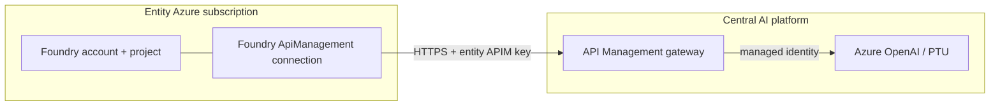

# Microsoft Foundry Agent behind a Central API Management Gateway

Deploy a Microsoft Foundry Standard Agent that consumes its model through an existing
Azure API Management (APIM) gateway, instead of a directly-attached Azure OpenAI resource.
The central APIM instance, Azure OpenAI resources, and PTU deployments stay owned and
governed by the central platform team; each entity only gets a published APIM endpoint
and a Product-scoped subscription key.

## Folders

| Folder | What it is |
| --- | --- |
| [`spoke-private-agent/`](spoke-private-agent) | Customer deployment, **private networking**: Foundry account + project, BYO Storage/Search/Cosmos, VNet, APIM connection, jumpbox VM (Azure Bastion). Deploy steps below. |
| [`public-foundry-agent/`](public-foundry-agent) | Customer deployment, **public networking**: same Standard Agent stack as the spoke, no VNet/jumpbox, plus an optional Document Intelligence account. See its own README. |
| [`public-foundry-agent-basic/`](public-foundry-agent-basic) | Minimal public variant: Foundry account + project + APIM connection only, Microsoft-managed storage. See its own README. |
| [`agent-samples/`](agent-samples) | Python scripts that create and chat with an agent through the APIM connection. See its own README. |
| [`hub-apim-openai/`](hub-apim-openai) | Reference only — sets up an isolated test APIM + Azure OpenAI backend. Do not apply to a shared platform APIM. |
| `code/` | Early scaffolding, not part of the supported flow — ignore. |

## How it works

The agent references its model as `<connection-name>/<deployment-name>` (e.g.
`hub-apim-openai/gpt-5.1`). Foundry resolves the connection, which points at the APIM
gateway URL, and APIM forwards the request to the backend Azure OpenAI deployment using
its own managed identity — no API keys reach Azure OpenAI, and the entity never gets
access to the backend.



Details on the connection, authentication, and model discovery are in
[`public-foundry-agent/README.md`](public-foundry-agent/README.md).

## Deploy `spoke-private-agent` (private networking)

**Prerequisites:**
- Terraform >= 1.10, Azure CLI logged in to the target subscription.
- `Contributor` + `User Access Administrator` on the subscription.
- From the central APIM team: APIM name/RG/subscription ID, published API path, an
  entity Product-scoped subscription key (never the master key), connection name,
  deployment alias, and inference API version.

**Steps:**

```pwsh
cd spoke-private-agent
```

1. Edit `environments/dev.tfvars`: subscription/location/RG, naming prefixes, VNet/subnet
   ranges, `hub_apim_*` values, `apim_openai_*` values.
2. Set secrets for this session only (never in files):
   ```pwsh
   $env:ARM_SUBSCRIPTION_ID           = "<subscription-id>"
   $env:TF_VAR_apim_subscription_key  = "<entity-product-scoped-apim-key>"
   $env:TF_VAR_jumpbox_admin_password = "<strong-password>"
   ```
3. Deploy:
   ```pwsh
   terraform init
   terraform plan -var-file="environments/dev.tfvars" -var="subscription_id=$env:ARM_SUBSCRIPTION_ID" -out="spoke.tfplan"
   terraform apply "spoke.tfplan"
   ```
4. Connect to the jumpbox (Azure portal → VM `terraform output jumpbox_vm_name` →
   **Connect → Bastion**, user `azureuser`, password from step 2). Install Python 3.12+
   and [uv](https://docs.astral.sh/uv/) — no `az login` needed, the VM's managed identity
   already has the **Foundry User** role.
5. On the jumpbox, copy `agent-samples/` there and follow its README to validate.

**Cleanup:**
```pwsh
terraform destroy -var-file="environments/dev.tfvars" -var="subscription_id=$env:ARM_SUBSCRIPTION_ID"
```

## Terraform state

Local runs use `spoke-private-agent/terraform.tfstate` (git-ignored) — fine for a single
operator. State contains the APIM key and jumpbox password in plaintext; never commit it.
For shared/CI use, the deploy workflow generates a git-ignored `backend.tf` and stores
state in Azure Storage instead (`spoke-private-agent-<env>.tfstate`).

## Deploy via GitHub Actions (optional)

`.github/workflows/terraform-validate.yml` runs `fmt`/`validate` on every PR/push touching
the spoke. `.github/workflows/terraform-deploy.yml` is a manual `plan`/`apply`/`destroy`
workflow using OIDC (no stored cloud credentials).

One-time setup: provision a state Storage account + container, create an OIDC app
registration with a federated credential for this repo, then configure GitHub
Environments `dev`/`prod` with:

| Type | Name |
| --- | --- |
| Variable | `TFSTATE_RESOURCE_GROUP`, `TFSTATE_STORAGE_ACCOUNT`, `TFSTATE_CONTAINER` |
| Secret | `AZURE_CLIENT_ID`, `AZURE_TENANT_ID`, `AZURE_SUBSCRIPTION_ID` |
| Secret | `TF_VAR_APIM_SUBSCRIPTION_KEY`, `TF_VAR_JUMPBOX_ADMIN_PASSWORD` |

Then: Actions → *Deploy Spoke (Private Agent)* → *Run workflow*. Note that GitHub-hosted
runners reach the Azure control plane fine but aren't inside the spoke VNet — creating and
using agents still requires the jumpbox unless you switch to a self-hosted runner in the VNet.

## Reference hub (`hub-apim-openai/`)

Isolated test setup only — creates an Azure OpenAI deployment and wires an **existing**
APIM instance for it (managed identity, imported API, discovery operations). Do not apply
to a shared platform APIM without the managing team's approval.

```pwsh
cd hub-apim-openai
$env:ARM_SUBSCRIPTION_ID = "<isolated-test-subscription-id>"
terraform init
terraform plan -var-file="environments/dev.tfvars" -out="hub.tfplan"
terraform apply "hub.tfplan"
```

## References

- [Bring your own model to Foundry Agent Service through an AI gateway](https://learn.microsoft.com/en-us/azure/foundry/agents/how-to/ai-gateway)
- [Official APIM setup guide for Foundry Agents](https://github.com/microsoft-foundry/foundry-samples/blob/main/infrastructure/infrastructure-setup-bicep/01-connections/apim/apim-setup-guide-for-agents.md)
- [Official Foundry APIM connection schema](https://github.com/microsoft-foundry/foundry-samples/blob/main/infrastructure/infrastructure-setup-bicep/01-connections/apim/APIM-Connection-Objects.md)
- [Import Azure OpenAI into API Management](https://learn.microsoft.com/en-us/azure/api-management/azure-openai-api-from-specification)
- [API Management managed-identity authentication policy](https://learn.microsoft.com/en-us/azure/api-management/authentication-managed-identity-policy)
- [Configure private link for Microsoft Foundry](https://learn.microsoft.com/en-us/azure/ai-foundry/how-to/configure-private-link)
- [AzAPI Provider](https://registry.terraform.io/providers/azure/azapi/latest/docs)

`Tags: Private Network, APIM, Standard Agent, Foundry, Terraform`
