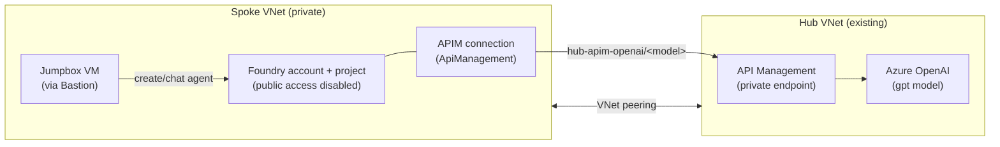

# Private Network Foundry Agent behind Azure API Management

Deploy a **private-network Microsoft Foundry standard agent** (spoke) that consumes an LLM
served through an **existing Azure API Management (APIM) gateway** (hub). All traffic stays on
private networking — the Foundry account has public access disabled, and the agent reaches the
model over VNet peering to the hub APIM private endpoint.

This repo is split into three parts you deploy/run in order:

| # | Folder | What it does |
| - | ------ | ------------ |
| 1 | [`hub-apim-openai/`](hub-apim-openai) | Creates an Azure OpenAI model and wires it behind your existing hub APIM (imports the inference API, sets the subscription-key policy, adds a private endpoint for the gateway). |
| 2 | [`spoke-private-agent/`](spoke-private-agent) | Deploys the private Foundry account + project (BYO Storage/Search/Cosmos), the spoke VNet, VNet peering to the hub, private DNS, an APIM **connection**, and a **jumpbox** VM (reached via Azure Bastion). |
| 3 | [`agent-samples/`](agent-samples) | Python scripts to create and chat with an agent that routes its model calls through the APIM connection. Run these **from the jumpbox**. |

> `code/` is early single-folder scaffolding and is **not** part of the supported flow — ignore it.

## Architecture



The agent references its model as `<connection-name>/<deployment-name>` (e.g.
`hub-apim-openai/gpt-5.1`). Foundry resolves the connection, which points at the APIM gateway
URL, and APIM forwards the request to the backend Azure OpenAI deployment.

## Prerequisites

- **Terraform** ≥ 1.10 ([install](https://developer.hashicorp.com/terraform/install))
- **Azure CLI** logged in: `az login`
- An **existing hub APIM** instance and permission to read its subscription key
- Sufficient quota in your target region for: 1 D-series VM (jumpbox), Cosmos DB, AI Search,
  Storage, and the Azure OpenAI model capacity
- Contributor + User Access Administrator (or Owner) on the target subscription (RBAC role
  assignments are created)

## Step 1 — Deploy the hub (model behind APIM)

```pwsh
cd hub-apim-openai
```

Non-secret config lives in per-environment files under `environments/`. Edit
`environments/dev.tfvars` (or copy `environments/prod.tfvars` for another environment):

| Variable | Set to |
| -------- | ------ |
| `subscription_id` | Your hub subscription ID |
| `location` | Region for the Azure OpenAI account (must offer your model) |
| `hub_apim_name` / `hub_apim_resource_group_name` | Your existing APIM instance |
| `model_name` / `model_version` / `model_sku_name` / `model_capacity` | The model to deploy |
| `api_path` | The APIM API path to expose the model under (e.g. `openai`) |

Deploy:

```pwsh
$env:ARM_SUBSCRIPTION_ID = "<your-hub-subscription-id>"
terraform init
terraform apply -var-file="environments/dev.tfvars"
```

## Step 2 — Set spoke secrets (never commit these)

The spoke needs two secrets that must **not** live in a tfvars file: the hub APIM subscription
key and the jumpbox admin password. Provide them as environment variables.

A ready-to-edit helper is included:
[`spoke-private-agent/set-secrets.example.ps1`](spoke-private-agent/set-secrets.example.ps1).
Copy it, fill in your hub APIM details, then dot-source it:

```pwsh
cd spoke-private-agent
Copy-Item set-secrets.example.ps1 set-secrets.ps1   # set-secrets.ps1 is git-ignored
# edit set-secrets.ps1: subscription id + APIM resource group/name
. .\set-secrets.ps1                                 # note the leading dot — dot-source it
```

This fetches the APIM subscription key, generates a compliant jumpbox password (printed once —
**save it** for Bastion login), and exports `TF_VAR_apim_subscription_key`,
`TF_VAR_jumpbox_admin_password`, and `ARM_SUBSCRIPTION_ID` into your shell.

Prefer to do it manually instead? Set these three before `apply`:

```pwsh
$env:ARM_SUBSCRIPTION_ID           = "<subscription-id>"
$env:TF_VAR_apim_subscription_key  = "<hub-apim-subscription-key>"
$env:TF_VAR_jumpbox_admin_password = "<strong-password>"
```

## Step 3 — Deploy the spoke (private agent)

Edit the non-secret config in `environments/dev.tfvars` — key values:

| Variable | Set to |
| -------- | ------ |
| `subscription_id` / `location` / `resource_group_name` | Your spoke subscription, region, RG |
| `vnet_address_space` and the four `*_subnet_prefix` values | A range that does **not** overlap your hub VNet |
| `hub_apim_name` / `hub_apim_resource_group_name` / `hub_apim_subscription_id` | Your hub APIM |
| `apim_openai_connection_name` | Name for the Foundry connection (e.g. `hub-apim-openai`) |
| `apim_openai_path` | Must match the hub `api_path` from Step 1 |
| `apim_inference_api_version` | Inference API version (e.g. `2024-10-21`) |

Deploy:

```pwsh
terraform init
terraform apply -var-file="environments/dev.tfvars"
```

Capture the outputs you'll need next:

```pwsh
terraform output foundry_account_name   # -> used to build the project endpoint
terraform output project_name
terraform output jumpbox_vm_name
```

## Step 4 — Connect to the jumpbox

The Foundry account has `publicNetworkAccess=Disabled`, so agents can only be created/used from
**inside the spoke VNet**. Use Azure Bastion to reach the jumpbox:

1. Azure portal → the jumpbox VM (`terraform output jumpbox_vm_name`) → **Connect → Bastion**.
2. User: `azureuser` (or your `jumpbox_admin_username`); Password: the one printed in Step 2.
3. On the VM, install [Python 3.12+](https://www.python.org/downloads/) and
   [uv](https://docs.astral.sh/uv/). The VM's managed identity is already authorized by the
   spoke Terraform, so no `az login` is required.

## Step 5 — Create and use the agent

Copy the [`agent-samples/`](agent-samples) folder onto the jumpbox (or `git clone` this repo
there), then follow [`agent-samples/README.md`](agent-samples/README.md):

```pwsh
cd agent-samples
Copy-Item .env.example .env   # set endpoint/connection/model from your terraform outputs
uv sync
uv run test_connection.py     # verifies the model responds through APIM
uv run create_agent.py        # creates a persistent agent
uv run chat_with_agent.py     # interactive chat
```

The spoke Terraform grants the jumpbox VM's managed identity the **Azure AI User** role on the
Foundry account, so `DefaultAzureCredential` can create and use agents out of the box.

## Terraform state — where it lives

| How you run | State location | When to use |
| ----------- | -------------- | ----------- |
| **Local** (the steps above) | `spoke-private-agent/terraform.tfstate` on your machine (git-ignored) | Single operator, quick tests. |
| **GitHub Actions / teams** | **Azure Storage** blob via the `azurerm` backend (state locking + versioning) | Shared/automated deployments. |

> ⚠️ **State contains every secret in plaintext** (APIM key, jumpbox password, connection
> secrets). Never commit it, and lock down the Storage account like a vault.

There is **no committed `backend.tf`**, so local runs stay backendless (local state). The deploy
workflow generates a `backend.tf` at runtime and points it at your Storage account — so the same
code works both ways.

### Bootstrap the state Storage account (run once)

```pwsh
$rg="rg-tfstate"; $sa="sttfstate$(Get-Random -Maximum 99999)"; $loc="eastus2"
az group create -n $rg -l $loc
# AAD-only (no storage keys), TLS1.2, no public blob access
az storage account create -n $sa -g $rg -l $loc --sku Standard_LRS --kind StorageV2 `
  --min-tls-version TLS1_2 --allow-blob-public-access false --allow-shared-key-access false
az storage container create --name tfstate --account-name $sa --auth-mode login
# Versioning + soft delete (recover a bad state)
az storage account blob-service-properties update -n $sa -g $rg `
  --enable-versioning true --enable-delete-retention true --delete-retention-days 7
# Give the deploy identity (and yourself) data-plane access
az role assignment create --assignee "<ci-or-your-objectId>" `
  --role "Storage Blob Data Contributor" `
  --scope $(az storage account show -n $sa -g $rg --query id -o tsv)
```

Use the resulting `$rg`, `$sa`, and container name as the GitHub `TFSTATE_*` variables below.
The workflow stores one blob per environment: `spoke-private-agent-<env>.tfstate`.

To adopt remote state for **local** runs too, create a `backend.tf` (it's git-ignored) and run
`terraform init -migrate-state -backend-config=...` with the same values.

## Deploy the spoke via GitHub Actions (optional)

The pipeline covers the **spoke** only. The hub (`hub-apim-openai`) is deployed manually — it
mostly exists to expose the model connection for testing — so deploy it once locally (Step 1)
before running the spoke pipeline.

Two workflows are included under [`.github/workflows/`](.github/workflows):

- **`terraform-validate.yml`** — runs `fmt -check` + `validate` on every PR/push that touches
  `spoke-private-agent/` (no cloud access needed).
- **`terraform-deploy.yml`** — manual (`workflow_dispatch`) `plan` / `apply` / `destroy` of the
  spoke for a chosen **environment** (`dev`/`prod`). It authenticates with **OIDC** (no stored
  cloud credentials) and stores state in Azure Storage.

### One-time setup

1. **Create the state Storage account** (once) and a container, e.g. `tfstate`. Lock it down
   (RBAC/AAD auth, versioning, soft delete). State holds secrets in plaintext — treat it like a
   vault.
2. **Create an OIDC identity** — an Entra app registration (or user-assigned managed identity)
   with a **federated credential** for this repo/environment, and grant it `Contributor` +
   `User Access Administrator` on the target subscription (RBAC assignments are created), plus
   `Storage Blob Data Contributor` on the state account.
3. **Configure GitHub** (repo → Settings). Create Environments `dev` and `prod` (add required
   reviewers on `prod`), then set:

   | Type | Name | Purpose |
   | ---- | ---- | ------- |
   | Variable | `TFSTATE_RESOURCE_GROUP` | State storage RG |
   | Variable | `TFSTATE_STORAGE_ACCOUNT` | State storage account name |
   | Variable | `TFSTATE_CONTAINER` | State container (e.g. `tfstate`) |
   | Secret | `AZURE_CLIENT_ID` / `AZURE_TENANT_ID` / `AZURE_SUBSCRIPTION_ID` | OIDC identity |
   | Secret | `TF_VAR_APIM_SUBSCRIPTION_KEY` | Hub APIM subscription key |
   | Secret | `TF_VAR_JUMPBOX_ADMIN_PASSWORD` | Jumpbox admin password |

   Non-secret config stays in `spoke-private-agent/environments/<env>.tfvars`; secrets stay in
   Environment secrets — the workflow maps them to `TF_VAR_*` automatically.

4. **Run it:** Actions → *Deploy Spoke (Private Agent)* → *Run workflow* → pick environment and
   `plan`/`apply`/`destroy`.

> **Private networking caveat:** GitHub-hosted runners provision fine over the Azure control
> plane, but they are **not** inside your VNet. Creating/using agents (data plane) still requires
> the jumpbox. If apply ever needs private data-plane access, use a **self-hosted runner** in the
> spoke VNet.

## Clean up

Destroy in reverse order (spoke first, then hub). Secrets must be present for `destroy` too:

```pwsh
cd spoke-private-agent
. .\set-secrets.ps1
terraform destroy -var-file="environments/dev.tfvars"

cd ..\hub-apim-openai
terraform destroy -var-file="environments/dev.tfvars"
```

> If `destroy` stalls on network resources, a service-association-link on the agent subnet may
> still be releasing. Wait a few minutes and retry.

## Troubleshooting

| Symptom | Cause / fix |
| ------- | ----------- |
| `SkuNotAvailable` / Cosmos `ServiceUnavailable` on apply | The region lacks capacity for the VM size or Cosmos. Choose a region that offers them. |
| Storage `403 KeyBasedAuthenticationNotPermitted` | The provider must use AAD auth (`storage_use_azuread = true`, already set in `providers.tf`). |
| `PlatformImageNotFound` on the jumpbox | The Windows image SKU isn't offered in your region — pick an available SKU in `jumpbox.tf`. |
| Agent scripts fail with network/DNS errors | Not running on the jumpbox. The Foundry account is private — run from inside the spoke VNet. |

## References

- [Configure private link for Microsoft Foundry](https://learn.microsoft.com/en-us/azure/ai-foundry/how-to/configure-private-link)
- [Azure API Management with virtual networks](https://learn.microsoft.com/en-us/azure/api-management/api-management-using-with-vnet)
- [AzAPI Provider](https://registry.terraform.io/providers/azure/azapi/latest/docs)

`Tags: Private Network, APIM, Standard Agent, Foundry, Terraform`
